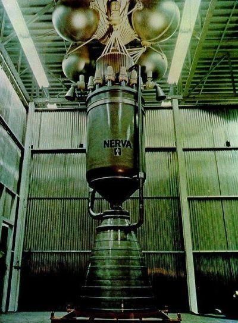

---?image=assets/image/kyle-gregory-devaras.jpg

Der Weltraum...

---?image=assets/image/kyle-gregory-devaras.jpg

Unendliche Weiten ...

---?image=assets/image/kyle-gregory-devaras.jpg

Wir schreiben das Jahr 2018 ...

---?image=assets/image/kyle-gregory-devaras.jpg

Dies sind leider nicht die Abenteuer des Raumschiff Enterprise.

---?image=assets/image/jeremy-bishop.jpg
@title[Weltraumtransporttechnologien]

 Weltraumtransporttechnologien

#### Ein Vortrag von Christian Grossmüller und Ida Schmidt

---?image=assets/image/jeremy-bishop.jpg

@title[Übersicht]

 Übersicht 

@ul
- Begriffserklärungen 
- Technologien zum Verlassen von Planeten 
- Technologien für das Interstellare Reisen 
- Projekte der Raumfahrtorganisationen 
- Sci-Fi Technologien 
@ulend
---?image=assets/image/jeremy-bishop.jpg
#### Begriffserklärungen

@ul
- Antrieb
- spezifischer Impuls
- "zum Verlassen von Planeten"
- "für Interstellare Reisen"
@ulend
---?image=assets/image/jeremy-bishop.jpg

@title[Übersicht]

 Übersicht 

- <strike>Begriffserklärungen</strike>
- Technologien zum Verlassen von Planeten
- Technologien für das Interstellare Reisen
- Projekte der Raumfahrtorganisationen
- Sci-Fi Technologien

---?image=assets/image/john-reign-abarintos.jpg

#### Technologieen zum Verlassen von Planeten.

---?image=assets/image/john-reign-abarintos.jpg

#### Technologieen zum Verlassen von Planeten.

---?image=assets/image/john-reign-abarintos.jpg

#### Technologieen zum Verlassen von Planeten.

---?image=assets/image/jeremy-bishop.jpg

@title[Übersicht]

 Übersicht 

- <strike>Begriffserklärungen</strike>
- <strike>Technologien zum Verlassen von Planeten</strike>
- Technologien für das Interstellare Reisen
- Projekte der Raumfahrtorganisationen
- Sci-Fi Technologien

---?image=assets/image/kyle-gregory-devaras.jpg

#### Technologieen für das Interstellare Reisen
@ul
- Elektrische Antriebe
- Atomare Antriebe
- andere Antriebe
@ulend

---?image=assets/image/kyle-gregory-devaras.jpg

#### Technologieen für das Interstellare Reisen
##### Elektrische Antriebe
@ul
- Lichtbogenantrieb
  - verbaut in "METEOR" Wettersateliten
  - benutzt zur Lageregelung
  - Erhitzung des Treibstoffes wird ausgenutzt
@ulend
@ul
- Hallantrieb
  - verbaut im SMART 1 Projekt der ESA
  - benutzt zur Beschleunigung
  - Ionisation des Treibstoffes wird ausgenutzt
@ulend

---?image=assets/image/kyle-gregory-devaras.jpg

#### Technologieen für das Interstellare Reisen
##### Nukleare Antriebe
@ul
- Erforschung in den 60er und 70er Jahren
- der Festkernreaktor - NERVA
- Reaktor Hitze wird ausgenutzt
@ulend

---?image=assets/image/kyle-gregory-devaras.jpg

#### Technologieen für das Interstellare Reisen
##### Andere Antriebe
@ul
- Sonnensegel
  - letztes Projekt LightSail (2015)
  - nutzt Impulsübertrag bei Reflektion von Licht
@ulend
@ul
- Tether
  - letztes Projekt STARS (2009)
  - nutzt Magnetfeld von Planeten durch Lorentzkraft  
@ulend

---?image=assets/image/jeremy-bishop.jpg

@title[Übersicht]

 Übersicht 

- <strike>Begriffserklärungen</strike>
- <strike>Technologien zum Verlassen von Planeten</strike>
- <strike>Technologien für das Interstellare Reisen</strike>
- Projekte der Raumfahrtorganisationen
- Sci-Fi Technologien

---?image=assets/image/john-reign-abarintos.jpg

#### Projekte der Raumfahrtorganisationen

---?image=assets/image/jeremy-bishop.jpg

@title[Übersicht]

 Übersicht 

- <strike>Begriffserklärungen</strike>
- <strike>Technologien zum Verlassen von Planeten</strike>
- <strike>Technologien für das Interstellare Reisen</strike>
- <strike>Projekte der Raumfahrtorganisationen</strike>
- Sci-Fi Technologien

---?image=assets/image/octavian-rosca.jpg

#### Sci-Fi Technologien
@ul
- Warp Drive - Wirklich nur Fiktion
@ulend
@ul
  - Alcubierre Drive
  - Benötigt "exotic matter"
  - Bewegung erfolgt indirekt
  - Antrieb "verformt" Raumzeit
@ulend
---?image=assets/image/octavian-rosca.jpg

#### Alcubiere Raumzeit

---?image=assets/image/octavian-rosca.jpg

#### Sci-Fi Technologien

@ul
- Hyperspace - Wo soll das sein?
@ulend
@ul
  - keine extra Raumdimension
  - Raumkomprimierung
  - Routenplanung
@ulend
  

---?image=assets/image/gitpitch-audience.jpg
## Vielen Dank für Eure Aufmerksamkeit

---?image=assets/image/gitpitch-audience.jpg
#### Quellen

- https://en.wikipedia.org/wiki/Alcubierre_drive
- http://jedipedia.wikia.com/wiki/Hyperraumroute
- http://jedipedia.wikia.com/wiki/Hyperantrieb
- https://de.wikipedia.org/wiki/Antriebsmethoden_f%C3%BCr_die_Raumfahrt
- https://www.wortbedeutung.info/Antrieb/
- https://de.wikipedia.org/wiki/Vertrag_%C3%BCber_das_Verbot_von_Kernwaffenversuchen_in_der_Atmosph%C3%A4re,_im_Weltraum_und_unter_Wasser
- https://www.bernd-leitenberger.de/zukuenftige_antriebe.shtml
- https://www.bernd-leitenberger.de/nukleare-antriebe.shtml
- https://de.wikipedia.org/wiki/Sonnensegel_(Raumfahrt)
- https://web.archive.org/web/20090201201834/http://stars1.eng.kagawa-u.ac.jp/english/index.html

---?image=assets/image/john-reign-abarintos.jpg

Irgendwas zu Technologieen zum Verlassen von Planeten.

  
