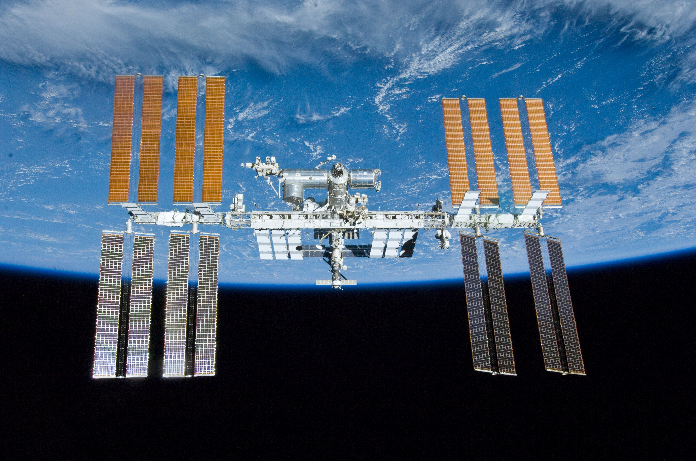

---?image=assets/image/kyle-gregory-devaras.jpg

Der Weltraum ...

---?image=assets/image/kyle-gregory-devaras.jpg

Unendliche Weiten ...

---?image=assets/image/kyle-gregory-devaras.jpg

Wir schreiben das Jahr 2018 ...

---?image=assets/image/kyle-gregory-devaras.jpg

Dies sind leider nicht die Abenteuer des Raumschiff Enterprise.

---?image=assets/image/jeremy-bishop.jpg
@title[Weltraumtransporttechnologien]

 Weltraumtransporttechnologien

#### Ein Vortrag von Christian Grossmüller und Ida Schmidt

---?image=assets/image/jeremy-bishop.jpg

@title[Übersicht]

 Übersicht 

@ul
- Begriffserklärungen 
- Technologien zum Verlassen von Planeten 
- Technologien für das Interstellare Reisen 
- Projekte der Raumfahrtorganisationen 
- Sci-Fi Technologien 
@ulend
---?image=assets/image/jeremy-bishop.jpg
#### Begriffserklärungen

@ul
- Antrieb
- spezifischer Impuls
- Schub
- "zum Verlassen von Planeten"
- "für Interstellare Reisen"
@ulend
---?image=assets/image/jeremy-bishop.jpg

@title[Übersicht]

 Übersicht 

- <strike>Begriffserklärungen</strike>
- Technologien zum Verlassen von Planeten
- Technologien für das Interstellare Reisen
- Projekte der Raumfahrtorganisationen
- Sci-Fi Technologien

---?image=assets/image/john-reign-abarintos.jpg

#### Kaltgas

@ul
  - Gas unter Druck aufbewahrt
  - Ausströmen durch Düsen
  - Schub zwischen 1mN – 100N
@ulend

---?image=assets/image/john-reign-abarintos.jpg

#### Aufheizen von Gasen

@ul
  - Ausdehnung erzeugt Druck und Schub
  - Solarthermischer Antrieb, Lightcraft
  - Noch nicht verwendet
@ulend

---?image=assets/image/john-reign-abarintos.jpg

#### Feststoffe

---?image=assets/image/john-reign-abarintos.jpg

#### Feststoffe - Vorteile

@ul
  - Keine Tanks
  - Treibstoff einfach zu handhaben
  - Abbrandcharakteristik vorhersehbar
@ulend

---?image=assets/image/john-reign-abarintos.jpg

#### Feststoffe - Nachteile
@ul
  - Kein Leertransport
  - Geringe Ausströmgeschwindigkeiten -> viel Treibstoff
  - Schub während Abrennen nicht regulierbar
@ulend

---?image=assets/image/john-reign-abarintos.jpg
#### Flüssig

@ul
  - Volumenzunahme erzeug Druck
@ulend

---?image=assets/image/john-reign-abarintos.jpg

#### Flüssig - Vorteile
@ul
  - Regulierbar
  - Unbetankte Montage
  - Effizienz
@ulend

---?image=assets/image/john-reign-abarintos.jpg

#### Flüssig - Nachteile

@ul
  - Hohe Kosten
  - Fehleranfällig
  - Änderung des Raketenschwerpunkts bei Verbrauch
  - Explosionsgefahr
@ulend

---?image=assets/image/john-reign-abarintos.jpg

#### Hybridraketen

@ul
  - Feststoff in Brennkammer, Flüssigkeit hinzugeben
  - Kontrollierbarer UND regulierbarer Ablauf
  - Geringere Risiken
  - Höhere Leitung als Flüssigtreibstoffe
@ulend

---?image=assets/image/jeremy-bishop.jpg

@title[Übersicht]

 Übersicht 

- <strike>Begriffserklärungen</strike>
- <strike>Technologien zum Verlassen von Planeten</strike>
- Technologien für das Interstellare Reisen
- Projekte der Raumfahrtorganisationen
- Sci-Fi Technologien

---?image=assets/image/kyle-gregory-devaras.jpg

#### Technologien für das Interstellare Reisen
@ul
- Elektrische Antriebe
- Atomare Antriebe
- andere Antriebe
@ulend

---?image=assets/image/kyle-gregory-devaras.jpg
#### Technologien für das Interstellare Reisen
##### Elektrische Antriebe
@ul
- Lichtbogenantrieb
- verbaut in "METEOR" Wettersateliten
- benutzt zur Lageregelung
- Erhitzung des Treibstoffes wird ausgenutzt
@ulend

---?image=assets/image/kyle-gregory-devaras.jpg
#### Technologien für das Interstellare Reisen
##### Elektrische Antriebe
@ul
- Hallantrieb
- verbaut im SMART 1 Projekt der ESA
- benutzt zur Beschleunigung
- Ionisation des Treibstoffes wird ausgenutzt
@ulend

---?image=assets/image/kyle-gregory-devaras.jpg

#### Technologien für das Interstellare Reisen
##### Nukleare Antriebe
@ul
- Erforschung in den 60er und 70er Jahren
- der Festkernreaktor - NERVA
- Reaktor Hitze wird ausgenutzt
@ulend

---?image=assets/image/kyle-gregory-devaras.jpg

#### Technologien für das Interstellare Reisen
##### Andere Antriebe
@ul
- Sonnensegel
- letztes Projekt LightSail (2015)
- nutzt Impulsübertrag bei Reflektion von Licht
@ulend

---?image=assets/image/kyle-gregory-devaras.jpg
#### Technologien für das Interstellare Reisen
##### Andere Antriebe
@ul
- Tether
- letztes Projekt STARS (2009)
- nutzt Magnetfeld von Planeten durch Lorentzkraft  
@ulend

---?image=assets/image/jeremy-bishop.jpg

@title[Übersicht]

 Übersicht 

- <strike>Begriffserklärungen</strike>
- <strike>Technologien zum Verlassen von Planeten</strike>
- <strike>Technologien für das Interstellare Reisen</strike>
- Projekte der Raumfahrtorganisationen
- Sci-Fi Technologien

---?image=assets/image/john-reign-abarintos.jpg

#### Projekte der Raumfahrtorganisationen
##### Indien - ISRO
@ul
- Satelliten, Trägerraketen, Bodentechnik
@ulend

---?image=assets/image/john-reign-abarintos.jpg

#### Projekte der Raumfahrtorganisationen
##### China - CNSA
@ul
- Tiangong 2 (seit 2016)
@ulend

---?image=assets/image/john-reign-abarintos.jpg

#### Projekte der Raumfahrtorganisationen
##### Europa - ESA
@ul
- Bemannte Raumfahrt, Trägerraketen, Space Science, Observing the Earth
- ISS (seit 1998)
@ulend

---?image=assets/image/john-reign-abarintos.jpg

#### Projekte der Raumfahrtorganisationen
##### USA - NASA
@ul
- Wiederverwendbare Raumschiffe
- ISS (seit 1998)
@ulend

---?image=assets/image/john-reign-abarintos.jpg

#### Projekte der Raumfahrtorganisationen
##### Russland - Roskosmos
@ul
- Satelliten
- ISS, Mars und Venusmissionen
@ulend

---?image=assets/image/jeremy-bishop.jpg

@title[Übersicht]

 Übersicht 

- <strike>Begriffserklärungen</strike>
- <strike>Technologien zum Verlassen von Planeten</strike>
- <strike>Technologien für das Interstellare Reisen</strike>
- <strike>Projekte der Raumfahrtorganisationen</strike>
- Sci-Fi Technologien

---?image=assets/image/octavian-rosca.jpg

#### Sci-Fi Technologien
@ul
- Warp Drive - Wirklich nur Fiktion?
@ulend
@ul
  - Alcubierre Drive
  - Benötigt "exotic matter"
  - Bewegung erfolgt indirekt
  - Antrieb "verformt" Raumzeit
@ulend
---?image=assets/image/octavian-rosca.jpg

#### Alcubiere Raumzeit

---?image=assets/image/octavian-rosca.jpg

#### Sci-Fi Technologien

@ul
- Hyperspace - Wo soll das sein?
@ulend
@ul
  - keine extra Raumdimension
  - Raumkomprimierung
  - Routenplanung
@ulend
  

---?image=assets/image/gitpitch-audience.jpg
## Vielen Dank für Eure Aufmerksamkeit

---?image=assets/image/gitpitch-audience.jpg
#### Quellen

- https://en.wikipedia.org/wiki/Alcubierre_drive
- http://jedipedia.wikia.com/wiki/Hyperraumroute
- http://jedipedia.wikia.com/wiki/Hyperantrieb
- https://de.wikipedia.org/wiki/Antriebsmethoden_f%C3%BCr_die_Raumfahrt
- https://www.wortbedeutung.info/Antrieb/
- https://bit.ly/1PuDc2F --> Verweis auf Wikipedia zum Vertrag über das Verbot von Kernwaffenversuchen
- https://www.bernd-leitenberger.de/zukuenftige_antriebe.shtml

---?image=assets/image/gitpitch-audience.jpg
#### Quellen

- https://www.bernd-leitenberger.de/nukleare-antriebe.shtml
- https://de.wikipedia.org/wiki/Sonnensegel_(Raumfahrt)
- https://web.archive.org/web/20090201201834/http://stars1.eng.kagawa-u.ac.jp/english/index.html
- https://bit.ly/2L1weYe --> Bild Tiangong
- https://bit.ly/2rEIXaI --> Bild ISS
- https://bit.ly/2IlntH6 --> Bild Ariane
- https://bit.ly/2Ihfa2P --> Bild Feststoffantrieb

---?image=assets/image/gitpitch-audience.jpg
#### Quellen
- https://bit.ly/2rDS1x5 --> Bild Flüssigkeitsantrieb
- https://www.bernd-leitenberger.de/feststofftriebwerke.shtml
- https://www.bernd-leitenberger.de/biligrak.shtml
- https://www.esa.int/ESA

  
